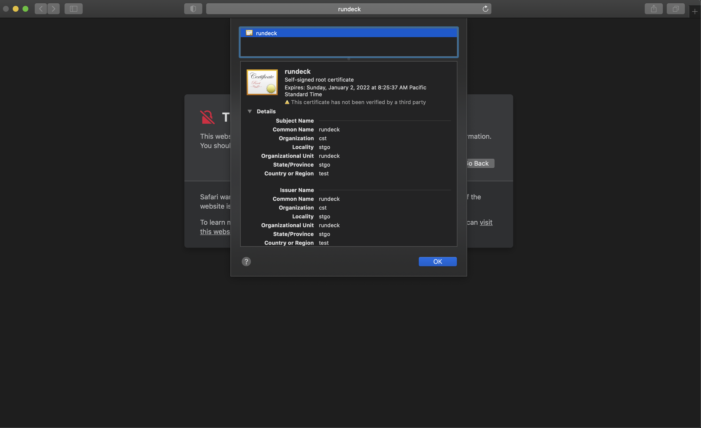

# Rundeck SSL

This project is a simple example to show how Rundeck docker images can be setup with a self-signed cert.

# Description 

Dockerfile:
```
ARG RUNDECK_IMAGE

FROM ${RUNDECK_IMAGE}

USER rundeck

COPY --chown=rundeck:root lib docker-lib
RUN chmod +x docker-lib/generate-ssl.sh
RUN ./docker-lib/generate-ssl.sh
```

docker-compose.yml:
```
version: "3"
services:
  rundeck:
    build:
      context: .
      args:
        RUNDECK_IMAGE: ${RUNDECK_IMAGE:-rundeckpro/enterprise:SNAPSHOT}
    container_name: rundeck-ssl
    command: "-Dserver.https.port=4443 -Drundeck.ssl.config=/home/rundeck/server/config/ssl.properties"
    ports:
    - 4443:4443
    environment:
      RUNDECK_GRAILS_URL: https://rundeck:4443
```

generate-ssl.sh (script on ```lib``` directory that creates the SSL cert on Rundeck image).:

```
#!/usr/bin/env bash

# creating the keystore
keytool -keystore etc/keystore \
        -alias rundeckssl \
        -genkey -keyalg RSA \
        -keypass adminadmin \
        -storepass adminadmin \
        -dname "C=test, S=stgo, OU= rundeck, L=stgo, O=cst, CN=rundeck"

# and now, copy as truststore
cp etc/keystore etc/truststore
Check the project for your tests:
```

**Build and Up**  

Build with docker-compose build and run with docker-compose up (then you can go to https://rundeck:4443 on your browser, add that hostname on your /etc/hosts to access it).

```
docker-compose build
docker-compose up -d
```

**Stop**
Use the following command to stop the system, but keep the work you've done so far:

```
docker-compose stop
```

To remove the containers that were built and free up space on your machine:

```
docker-compose down
```

**Full Clean**
This command will remove all associated volumes and images as well.
```
docker-compose down --volume --rmi all
```

## Download Cert from Browser
Because this is a self-signed cert, you will need to make sure your system and browsers (including Chrome, Firefox, Safari, Edge, etc.) will accept your certificate as valid.


